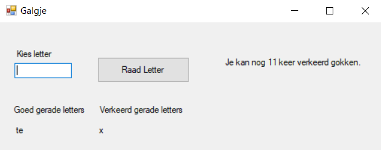

# Galgje application
## Summary
This application is an implementation of what we call 'galgje' in Holland.  
In English this game is called hangman.  
The file structure contains a text file in which the word is stored.  
After reading the word in, the application asks the user for letters until all letters of the word have been guessed right or until you've had 12 wrong guesses.

## Interface
The application has a simple interface as it's meant for learning coding in C#.  
Below you see a screenshot of the application showcasing the various information displayed.  

## Running the application
This application can be run in Visual Studio.  
Just download the source code, open it en press start!